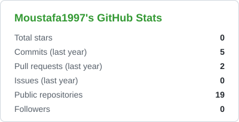
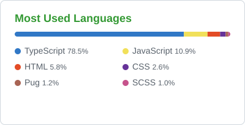
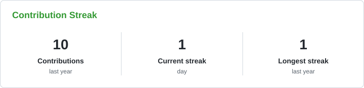
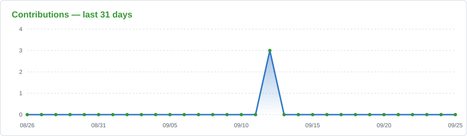

<a name="top"></a>


<p align="center">
  
</p>

<p align="center">
  <a href="https://www.linkedin.com/in/moustafa-aboulazm"></a>
  <a href="mailto:moustafa.aboulazm1997@gmail.com"></a>
  <a href="https://github.com/Moustafa1997?tab=repositories"></a>
</p>

<p align="center">
  
  
  
</p>

---

## 👋 About me

I'm a **Backend Engineer** who enjoys turning complex business problems into clean, reliable, and scalable APIs.
Most of my recent work lives in **fintech** — moving real money, verifying real users, and streaming real-time prices — where correctness and security aren't optional.

```ts
const moustafa = {
  role: "Backend Engineer",
  currentlyBuilding: "Digital gold & silver investment fintech",
  stack: ["Node.js", "TypeScript", "NestJS", "Express", "Redis", "Docker"],
  experiencedWith: ["Payments", "KYC", "Real-time pricing", "Secure transactions", "ERP systems"],
  education: "B.Sc. Computer Science — Menofia University (Grade: 100%)",
  location: "Menofia, Egypt 🇪🇬",
  openTo: ["Remote", "Hybrid"],
  languages: { arabic: "Native", english: "Professional working proficiency" },
  hobbies: ["Drawing 🎨"],
};
```

---

## 🛠️ Tech Stack

<table>
  <tr>
    <td align="center" width="140"><b>Languages & Runtime</b></td>
    <td>
      
      
      
      
    </td>
  </tr>
  <tr>
    <td align="center"><b>Frameworks</b></td>
    <td>
      
      
      
    </td>
  </tr>
  <tr>
    <td align="center"><b>Databases</b></td>
    <td>
      
      
      
      
    </td>
  </tr>
  <tr>
    <td align="center"><b>DevOps & Cloud</b></td>
    <td>
      
      
      
      
    </td>
  </tr>
  <tr>
    <td align="center"><b>Concepts</b></td>
    <td>REST APIs · Microservices · JWT Auth · WebSockets · CI/CD · Unit & Integration Testing · Design Patterns · OOP · MVC</td>
  </tr>
</table>

### 🌱 Currently learning

<p>
  
  
  
</p>

---

## 💼 Experience highlights

| Project | What I built | Key tech |
|---|---|---|
| 🪙 **Sabika** | Backend for a gold-trading fintech: Bank Misr CyberSource payments, real-time gold pricing, KYC verification, P2P transfers, serial-tracked inventory, and automated PDF invoices | Node.js · TypeScript · Socket.IO · Redis · Docker · CyberSource |
| 💸 **Capital Numbers** | Backend for a multilingual money-transfer app connecting users, banks, and agencies, plus scalable ERP modules | Node.js · REST APIs · ERP modules |
| 📡 **MATN** | Real-time apps with live streaming, chat, geolocation, and secure payments | Real-time · Geolocation · Payments |

---

## 📌 Featured Projects

| Project | Description |
|---|---|
| 🧭 **[Nature Tours API](https://github.com/Moustafa1997/Nature-Tours)** | Tourism platform with advanced filtering, geolocation queries, bookings & Stripe payments |
| 🛒 **[Store Backend](https://github.com/Moustafa1997/StoreBackend)** | E-commerce API in TypeScript with authentication, orders & integration testing |
| ❄️ **[Smart Fridge API](https://github.com/Moustafa1997/smart-fridge)** | Graduation project — API serving a Flutter app connected to a hardware fridge |
| ☁️ **[AWS Hosting Pipeline](https://github.com/Moustafa1997/hosting-aws)** | Full-stack deployment to AWS (RDS, Elastic Beanstalk, S3) with a CircleCI CI/CD pipeline |

---

## 📊 GitHub Stats

<p align="center">
  
  
</p>

<p align="center">
  
</p>

<p align="center">
  
</p>

<p align="center"><sub>Stats cards refresh daily via GitHub Actions.</sub></p>

---

## 🤝 Let's connect

I'm always happy to talk about **backend architecture, fintech, real-time systems**, or new opportunities.

<p align="center">
  <a href="https://www.linkedin.com/in/moustafa-aboulazm"></a>
  <a href="mailto:moustafa.aboulazm1997@gmail.com"></a>
</p>


<p align="right"><a href="#top">⬆️ Back to top</a></p>
